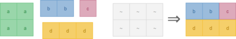

# What's this?
Regular expressions that do things!  
.NET has a unique regular expression engine which captures strings into a stack and allow full access to it during the match using [balancing groups](https://stackoverflow.com/q/17003799/7586).

# How to use?
The easiest option is to run `dotnet test`, this will run all existing tests and write output to console.

# So what's in there?

## Maze-solving regex
Source: [`Mazes.cs`](RecreationalRegex/Mazes/Mazes.cs)  
Blog post: [Solving mazes using regular expressions](https://kobikobi.wordpress.com/2013/07/06/solving-mazes-using-regular-expressions/)  


## Implement PCRE recursive grammar in .NET regex balancing groups
Source: [`PcreGrammar.cs`](RecreationalRegex/PcreGrammar/PcreGrammar.cs)  
For a Stack Overflow answer - which took me **3 years** to figure out.  I ended up writing code to generate a regex from an intermediate stack-based grammar. fun stuff: [Converting PCRE recursive regex pattern to .NET balancing groups definition](https://stackoverflow.com/a/20644634/7586)  
How can we write this grammar using .NET's balancing groups?
```
Q -> \w | '[' A ';' Q* ','? Q* ']' | '<' A '>'
A -> (Q | ',')*
// match A
```

## Rectangle puzzle solver
Source: [`SmallRectangles.cs`](RecreationalRegex/Rectangles/SmallRectangles.cs)
Blog post: [Filling a large rectangle with smaller rectangles using regular expressions](https://kobikobi.wordpress.com/2016/10/11/filling-a-large-rectangle-with-smaller-rectangles-using-regular-expressions/)  


## Regex to find comments in regex
Yep  
Source: [`StackOverflowAsnwers.cs - FindRegexComments`](RecreationalRegex/StackOverflowAnswers/StackOverflowAsnwers.cs)
Stack Overflow answer: [How to extract regex comment?](https://stackoverflow.com/q/5073826/7586)

## Match the Fibonacci sequence
O NO BAD REGEX MATCHING OBJECTIONABLE HUMUHUMUNUKUNUKUAPUAA   
Source: [`Fibonacci.cs`](RecreationalRegex/WordLengths/Fibonacci.cs)  
Blog post: [Match Words in Fibonacci Lengths](https://kobikobi.wordpress.com/2010/09/06/using-net-regex-balancing-groups-to-match-words-in-fibonacci-lengths/)  
Random thought: If we're only matching the same character (`x xx xxx xxxxx`...), it's possible to write [self-referencing capturing groups](https://stackoverflow.com/q/3644266/7586) to match these - see Stack Overflow post by polygenelubricants.

## Numeric
* Compare binary and decimal numbers - match pairs like `4:100` and `1342:10100111110`.  
Source: [`ParseNumbers.cs`](RecreationalRegex/Numeric/ParseNumbers.cs)  
Blog post: [Using the Stack State to Understand Numeric Values](https://kobikobi.wordpress.com/2011/04/25/net-regular-expressions-using-the-stack-state-to-understand-numeric-values/)
* Check if a number is divisible by 3 - stack-based approach.  
Source: [`/DivisibleByThree.cs`](RecreationalRegex/Numeric/DivisibleByThree.cs)  
Blog post: [Finding Decimal Numbers that are Divisible by Three](https://kobikobi.wordpress.com/2011/05/19/net-regular-expressions-finding-decimal-numbers-that-are-divisible-by-three/)

## Match mixed balanced parentheses
Match balanced expressions with mixed kinds of parentheses, for example `{3[5]([12]34)}`. This is highly irregular.  
Source: [`Parentheses.cs`](RecreationalRegex/Parentheses/Parentheses.cs)  
Blog post: [Matching Mixed Balanced Parentheses](https://kobikobi.wordpress.com/2010/12/14/net-regex-matching-mixed-balanced-parentheses/)

## Acronym finder
Match acronym and their meaning, for example `Three Lettered Acronyms (TLA)`  
Source: [`StackOverflowAsnwers.cs - FindAcronymsRegex`]  
Blog post: [Finding Acronyms in text, and Reversing the Stack](https://kobikobi.wordpress.com/2011/01/04/net-regular-expressions-finding-acronyms-and-reversing-the-stack/)

## Find cartesian product between letters of two words
Get two words as input and return all combinations of letters: `123 abcd`: `1a 1b 1c 1d 2a 2b 2c 2d 3a 3b 3c 3d`
Source: [`CartesianProductTests.cs`](RecreationalRegex/Combinatorics/CartesianProductTests.cs)

## Sudoku Validator
Source: [`SolutionValidator.cs - SudokuValidatorPattern`](RecreationalRegex/Sudoku/SolutionValidator.cs)
